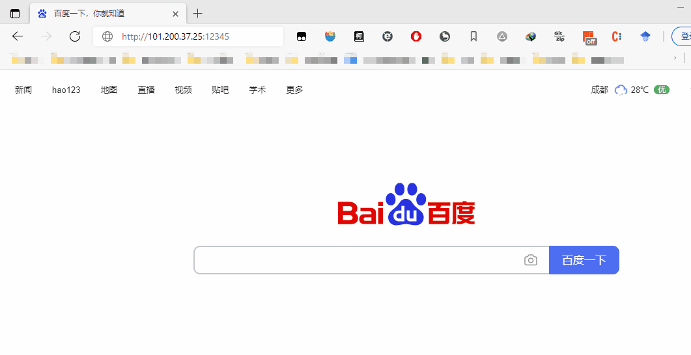
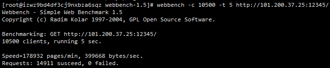

# WebServer
 
1. 使用 线程池 + 非阻塞socket + epoll(边缘触发) + 事件处理(模拟Reactor) 的并发模型
2. 使用状态机解析HTTP请求报文，支持解析GET和POST请求
3. 引入数据库连接池，访问服务器数据库实现用户登录
4. 利用升序定时器链表处理非活动连接
5. 实现同步/异步日志系统，记录服务器运行状态
6. 经Webbench压力测试可以实现上万的并发连接数据交换

服务器：阿里云轻量级应用服务器(1核2G)

## 前提
### MySql
创建`http_serv`数据库,添加`register_table`表；表字段为`user`,`pass`。

	mysql> use http_serv;
	Database changed
	mysql> show tables;
	+---------------------+
	| Tables_in_http_serv |
	+---------------------+
	| register_table      |
	+---------------------+
	1 row in set (0.00 sec)

	mysql> show columns from register_table;
	+-------+--------------+------+-----+---------+-------+
	| Field | Type         | Null | Key | Default | Extra |
	+-------+--------------+------+-----+---------+-------+
	| user  | varchar(255) | YES  |     | NULL    |       |
	| pass  | varchar(255) | YES  |     | NULL    |       |
	+-------+--------------+------+-----+---------+-------+
	2 rows in set (0.00 sec)

## 编译&&运行

	make
	./main

## 使用
### 访问

### webbench压力测试
测试并发量10500全部请求成功

QPS：178932/60≈3000

## 迭代版本
### v1(于线程池简单web服务器)
源自<<Linux高性能服务器编程>>代码
1. 半同步半反应堆线程池 + 模拟proactor模式
2. 有限状态机
3. epoll边缘触发

### v2(处理post请求)

### v3(加入数据库,数据库连接池)
* mysql数据库

### v4(定时器)
* 统一事件源
* 升序定时器链表

### v5(日志系统)
* 阻塞队列
* 生产者消费者模型

## 参考
* Linux高性能服务器
* TCP/IP网络编程
* [TinyWebServer](https://github.com/qinguoyi/TinyWebServer)